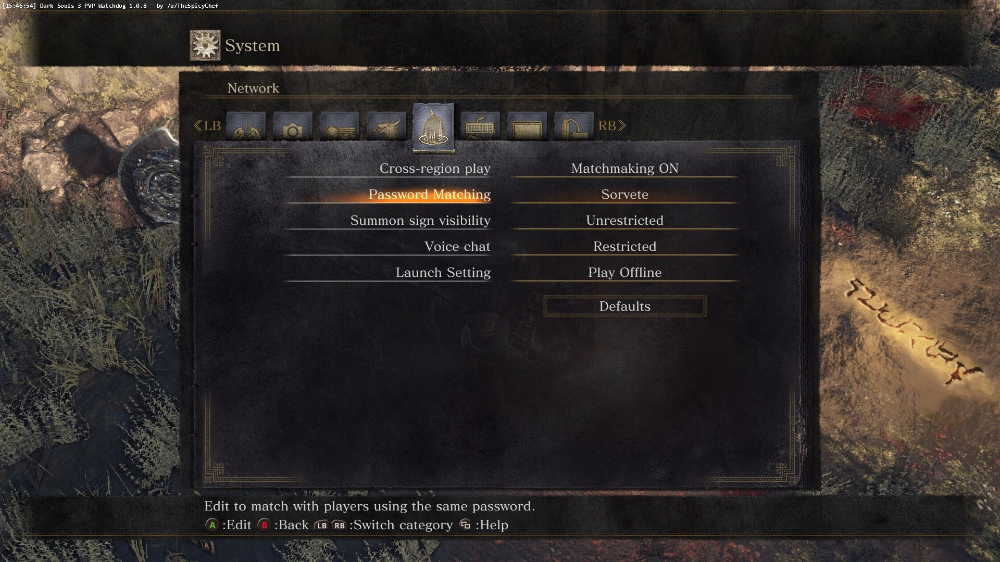

# Introduction

As a beginner to Dark Souls 3, there are various tasks that can help you to
progress and finish the game. These are listed below:

1. Choose Knight as your starting class. Generally, your starting class only
   matters at the very early stages of the game. As you progress through the
   game, you can level up and pump your stats into those attributes you care
   about. For the remainder of this walkthrough, we will use Deprived as our
   starting class. The reason is that the Deprived starting class has a decent
   distribution of stats. Various useful sorceries, miracles, and pyromancies
   can be attuned and used by only having to equip certain rings and without
   having to invest some levels in various attributes. Choose "Rusted Gold Coin"
   as your Burial Gift. You would be given seven Rusted Gold Coins, which are
   immensely useful for farming certain (rare) items.
1. Infuse your melee weapons with Raw Gems. A raw weapon has high base damage
   output, but at the cost of losing any stats scaling. You only need to invest
   enough points in Strength and/or Dexterity to wield the weapon. Infusing your
   weapon with a Raw Gem allows you to have high damage output without having to
   invest more points into Strength and/or Dexterity. Your raw weapon loses
   stats scaling. The only ways to increase the damage output of your raw weapon
   are: (1) upgrading it with various upgrade materials; and (2) buffing your
   weapon with fire, lightning, magic, etc.
1. Obtain a bow or the Light Crossbow as early as possible. Many enemies in the
   game are usually found as mobs scattered here and there. Use a ranged weapon
   to pull one enemy at a time away from its mob and dispatch of enemies one at
   a time. As our starting class will be Deprived, we have enough stats to wield
   a Light Crossbow. The Longbow is available after the tutorial area of the
   game. A Knight or Deprived starting class character won't have enough stats
   to properly wield the Longbow. However, you can still use the Longbow to pull
   enemies one at a time. Without sufficient stats to wield the Longbow, the
   damage dealt to enemies would be minuscule.
1. Use a shield to block if you need to, but don't rely on your shield to carry
   you through the whole game. Some enemies can block with their shields.
   One-handing your melee weapon and attacking would result in your weapon
   bouncing off an enemy's shield. Generally, two-handing your melee weapon is
   more effective against enemies that block with their shields. Your two-handed
   weapon won't bounce off an enemy's shield and you would still deal some
   damage, albeit minimum.
1. Don't attack your NPCs. Exhaust each NPC's dialogue and regularly return to
   Firelink Shrine to talk to your NPCs.
1. Read item descriptions. Experiment with items and weapons to find out how
   they can be used to suit your play style.
1. For your first playthrough, set your game to be offline by default. In the
   Network tab of your System menu, locate "Launch Setting" and set it to "Play
   Offline".

    

1. Various tasks can be done to minimize your time spent farming souls. First,
   defeat all enemies in each area. Second, grab all items scattered throughout
   an area. Many items found in an area are soul items that, once consumed,
   would give you certain amounts of souls.
1. Be patient. Explore each area and take your time to learn attack patterns of
   difficult enemies. An enemy might seem tough at first and you might die to it
   many times. There is always an easy way to defeat any enemy. The difficult
   part is figuring out how.
1. Use the following checklist to help you keep track of your playthrough:

    https://zkjellberg.github.io/dark-souls-3-cheat-sheet/

If you ever need to farm souls for levelling up or to purchase items, refer to
the following guide:

https://steamcommunity.com/sharedfiles/filedetails/?id=2081240775
